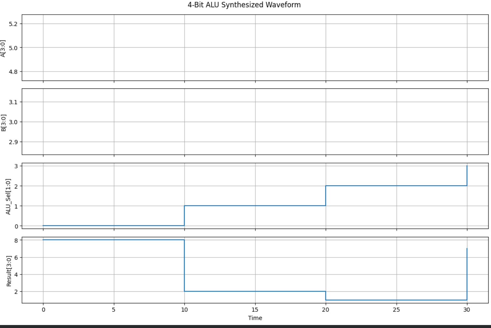

# Design and Verification of a 4-Bit ALU Using Verilog HDL

## 📌 Project Overview

This project presents the design and verification of a 4-bit Arithmetic Logic Unit (ALU) using Verilog HDL.

The ALU performs basic arithmetic and logical operations on two 4-bit binary inputs. The design is verified using a Verilog testbench and simulated using EDA Playground.

## 🎯 Objectives

- Design a 4-bit ALU using Verilog HDL.
- Implement basic arithmetic and logical operations.
- Develop a Verilog testbench for functional verification.
- Simulate the ALU design.
- Analyze the simulation waveform.
- Document the complete project on GitHub.

## ⚙️ ALU Operations

| ALU Select | Operation | Description |
|------------|-----------|-------------|
| 00 | Addition | A + B |
| 01 | Subtraction | A - B |
| 10 | AND | A & B |
| 11 | OR | A \| B |

## 🔌 Inputs and Outputs

### Inputs

- `A` – 4-bit input
- `B` – 4-bit input
- `ALU_Sel` – 2-bit operation selector

### Output

- `Result` – 4-bit ALU output

## 🧩 Block Diagram

```text
       A[3:0]
          |
          |
          v
     +-----------+
     |           |
B -->|   4-Bit   |----> Result[3:0]
     |    ALU    |
     |           |
     +-----------+
          ^
          |
      ALU_Sel[1:0]
## 💻 Design

The 4-bit ALU is implemented using Verilog HDL with combinational logic.

The `ALU_Sel` input selects the required arithmetic or logical operation using a `case` statement.
## 🧪 Verification

A Verilog testbench was developed to verify all four ALU operations.

Test inputs:

- A = `0101`
- B = `0011`

Expected results:

| Operation | ALU Select | Expected Result |
|-----------|------------|-----------------|
| Addition | 00 | 1000 |
| Subtraction | 01 | 0010 |
| AND | 10 | 0001 |
| OR | 11 | 0111 |
## 📊 Simulation Result

The ALU was successfully simulated using EDA Playground.

All four implemented operations produced the expected results.
## 📈 Waveform

The simulation waveform shows the changes in:

- A
- B
- ALU Select
- Result

The waveform screenshot is included in this repository.
## 🛠️ Tools Used

- Verilog HDL
- EDA Playground
- Icarus Verilog
- EPWave
- GitHub
## 🚀 Future Scope

The project can be extended by adding:

- XOR operation
- NAND operation
- NOR operation
- Carry output
- Zero flag
- Overflow detection
- RTL synthesis
- Area and timing analysis
## 👨‍💻 Author

4-Bit ALU Design and Verification Project
## Simulation Results

### RTL Simulation Waveform


## Synthesis Results

The 4-bit ALU was synthesized using Yosys.

### Synthesis Statistics

| Parameter | Value |
|---|---:|
| Number of wires | 30 |
| Number of wire bits | 99 |
| Number of public wires | 4 |
| Number of public wire bits | 14 |
| Number of memories | 0 |
| Number of processes | 0 |
| Number of cells | 84 |
| AND gates | 27 |
| MUX gates | 4 |
| NOT gates | 11 |
| OR gates | 28 |
| XOR gates | 14 |

The synthesized Verilog netlist is available in:

`alu_synthesized.v`

The complete Yosys synthesis report is available in:

`synthesis_report.txt`

## Simulation Results

### ALU Simulation Waveform


### RTL Simulation Waveform


### Synthesized ALU Waveform



## Synthesis Results

The 4-bit ALU was synthesized using Yosys.

### Synthesis Statistics

| Parameter | Value |
|---|---:|
| Number of wires | 30 |
| Number of wire bits | 99 |
| Number of public wires | 4 |
| Number of public wire bits | 14 |
| Number of memories | 0 |
| Number of processes | 0 |
| Number of cells | 84 |
| AND gates | 27 |
| MUX gates | 4 |
| NOT gates | 11 |
| OR gates | 28 |
| XOR gates | 14 |

The synthesized Verilog netlist is available in:

`alu_synthesized.v`

The complete Yosys synthesis report is available in:

`synthesis_report.txt`
